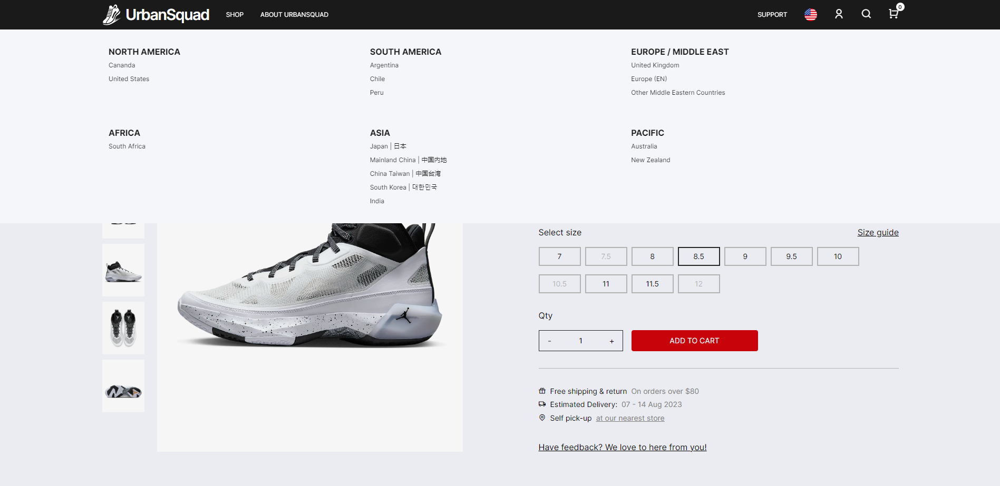

# Frontend Mentor - E-commerce product page solution

This is a solution to the [E-commerce product page challenge on Frontend Mentor](https://www.frontendmentor.io/challenges/ecommerce-product-page-UPsZ9MJp6). Frontend Mentor challenges help you improve your coding skills by building realistic projects.

## Table of contents

- [Overview](#overview)
  - [The challenge](#the-challenge)
  - [Screenshot](#screenshot)
  - [Links](#links)
- [My process](#my-process)
  - [Built with](#built-with)
  - [What I learned](#what-i-learned)
  - [Continued development](#continued-development)
  - [Useful resources](#useful-resources)
- [Author](#author)
- [Acknowledgments](#acknowledgments)


## Overview

### The challenge

Users should be able to:

- View the optimal layout for the site depending on their device's screen size
- See hover states for all interactive elements on the page
- Open a lightbox gallery by clicking on the large product image
- Switch the large product image by clicking on the small thumbnail images
- Add items to the cart
- View the cart and remove items from it

### Screenshot

- Main
- Add to Cart
- Header
- Reviews
- Mobile menu

### Links

- Solution URL: [Add solution URL here](https://your-solution-url.com)
- Live Site URL: [Add live site URL here](https://your-live-site-url.com)


## My process

### Built with

- Semantic HTML5 markup
- CSS custom properties
- Flexbox
- CSS Grid
- Mobile-first workflow

### What I learned

#### Shortcuts
- HTML
  - #page.site>header+main+footer. #page is the id of the parent div, while .site is the class of the parent div.
  - .header-top>.container>.wrapper.flexitem>.left+.right
  - ul.flexitem.main-links>li*3>a

#### Nesting and toggle
```
<li class="shop" id="shop-featured-sale" onclick="plusMinusToggle(this)">
  <span class="hidden">Featured & Sale</span>
  <span class="plusminus"></span>
  <ul>
    <li><a href="#" class="shop-highlights">New Arrivals</a></li>
    <li><a href="#" class="shop-highlights">Limited Editions</a></li>
  </ul>
</li>
```
If the function onclick="plusMinusToggle(this)" is placed next to 'Featured & Sale', this second onclick won't work because the event is not being propagated properly. The nested <span> element with the class "plusminus" is inside the <span> element with the class "hidden". When you click on the nested <span>, the click event is captured by the outer <span> element, which has the "hidden" class.

In the above code, the onclick event is now attached to the parent <li> element with the class "shop". 
The plusMinusToggle() function is also modified to accept the element parameter, which refers to the clicked parent element. 
Inside the function, we use element.querySelector('.plusminus') to find the nested element with the class "plusminus" relative to the clicked parent element. 
This way, the toggle should work for both the first and second instances of the "plusminus" element.

#### Simple slide animation - 2 ways
- Using css, data-visible attribute and javascript to switch between true and false
```
.main-navLinks--others { /*building the side nav*/
      display: flex;
      flex-direction: column;
      align-items: start;
      justify-content: start;
      position: fixed;
      inset: 0 20% 0 0;
      background-color: var(--very-light-gray);
      gap: 0;
      transform: translateX(-100%);
      transition: transform 0.3s ease-out;
      z-index: 1000;
  }

  .main-navLinks--others[data-visible="true"] {
      transform: translateX(0);
  }
```
- Using animation & key frames in css
```
.header-sub-menu {
    background-color: var(--very-light-gray);
    position: fixed;
    top: 3.75rem;
    left: 0; /* doesn't matter left or right */
    width: 100%;
    display: none; 
    z-index: -1;
    animation: slide .5s cubic-bezier(0.39, 0.575, 0.0565, 1) both;
}

@keyframes slide {
    0% {
        transform: translateY(-100%);
    }

    100% {
        transform: translateY(0);
    }
}
```

#### Customizing scrollbar
```
.scrollto {
    overflow-x: auto;
    overscroll-behavior-inline: contain;
    scroll-snap-type: inline mandatory;
}

.scrollto::-webkit-scrollbar {
   width: var(--r12);
   height: var(--r12); 
}

.scrollto::-webkit-scrollbar-thumb {
    background-color: var(--light-gray);
    border: 3px solid var(--white); 
    border-radius: var(--r20);
}

.scrollto:hover::-webkit-scrollbar-thumb {
    background-color: var(--gray3);
}
```

### Continued development

To develop this into a full stack e-commerce app

### Useful resources

- [Swiper.js](https://swiperjs.com/get-started) - This is an amazing library that makes customizing of sliders or carousels so much easier. Note that I am using v8 instead of v9 as v9 no longer supports DOm7 library. So if you are using plain JS, use v8 first.


## Author

- Frontend Mentor - [@Jo-cloud85](https://www.frontendmentor.io/profile/Jo-cloud85)


## Acknowledgments

About Section Photos:
- Photo by <a href="https://unsplash.com/@von_co?utm_source=unsplash&utm_medium=referral&utm_content=creditCopyText">Ivana Cajina</a> on <a href="https://unsplash.com/photos/TUXUCVXmjQk?utm_source=unsplash&utm_medium=referral&utm_content=creditCopyText">Unsplash</a>
- Photo by <a href="https://unsplash.com/de/@benwhitephotography?utm_source=unsplash&utm_medium=referral&utm_content=creditCopyText">Ben White</a> on <a href="https://unsplash.com/photos/gEKMstKfZ6w?utm_source=unsplash&utm_medium=referral&utm_content=creditCopyText">Unsplash</a>
- Photo by <a href="https://unsplash.com/@opeleye?utm_source=unsplash&utm_medium=referral&utm_content=creditCopyText">Jordan Opel</a> on <a href="https://unsplash.com/photos/ybLtRkjHprE?utm_source=unsplash&utm_medium=referral&utm_content=creditCopyText">Unsplash</a>

- Photo by <a href="https://unsplash.com/fr/@aaronbrogden?utm_source=unsplash&utm_medium=referral&utm_content=creditCopyText">Aaron Brogden</a> on <a href="https://unsplash.com/photos/uPrxxLSkovY?utm_source=unsplash&utm_medium=referral&utm_content=creditCopyText">Unsplash</a>
- Photo by <a href="https://unsplash.com/@johnarano?utm_source=unsplash&utm_medium=referral&utm_content=creditCopyText">John Arano</a> on <a href="https://unsplash.com/photos/qZaAkHOlIeQ?utm_source=unsplash&utm_medium=referral&utm_content=creditCopyText">Unsplash</a>
- Photo by <a href="https://unsplash.com/@jonathanborba?utm_source=unsplash&utm_medium=referral&utm_content=creditCopyText">Jonathan Borba</a> on <a href="https://unsplash.com/photos/lrQPTQs7nQQ?utm_source=unsplash&utm_medium=referral&utm_content=creditCopyText">Unsplash</a>
- Photo by <a href="https://unsplash.com/@bluespit?utm_source=unsplash&utm_medium=referral&utm_content=creditCopyText">Shingi Rice</a> on <a href="https://unsplash.com/photos/U3nuByd0GJU?utm_source=unsplash&utm_medium=referral&utm_content=creditCopyText">Unsplash</a>
- Photo by <a href="https://unsplash.com/@felipepelaquim?utm_source=unsplash&utm_medium=referral&utm_content=creditCopyText">@felipepelaquim</a> on <a href="https://unsplash.com/photos/6zO5VKogoZE?utm_source=unsplash&utm_medium=referral&utm_content=creditCopyText">Unsplash</a>
  
Footer design inspiration
- [Under Armour](https://www.underarmour.com.sg/en-sg/)
- [Nike](https://www.nike.com/t/air-jordan-xxxvii-basketball-shoes-MttxV5)
  
  
  
PlusMinus Toggle
- [Plus Minus animation](https://codepen.io/NeedHate/pen/oezqbK)

Moving Hover Button Effect
- [Moving Hover Button](https://uiverse.io/gksckt/young-eagle-60)

Custom Swiper Nav Buttons
- [Custom Swiper Nav](https://www.youtube.com/watch?v=kmjIl6FdS8o)
